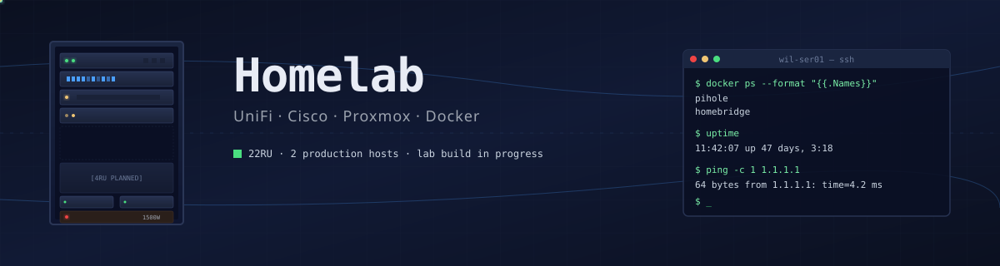
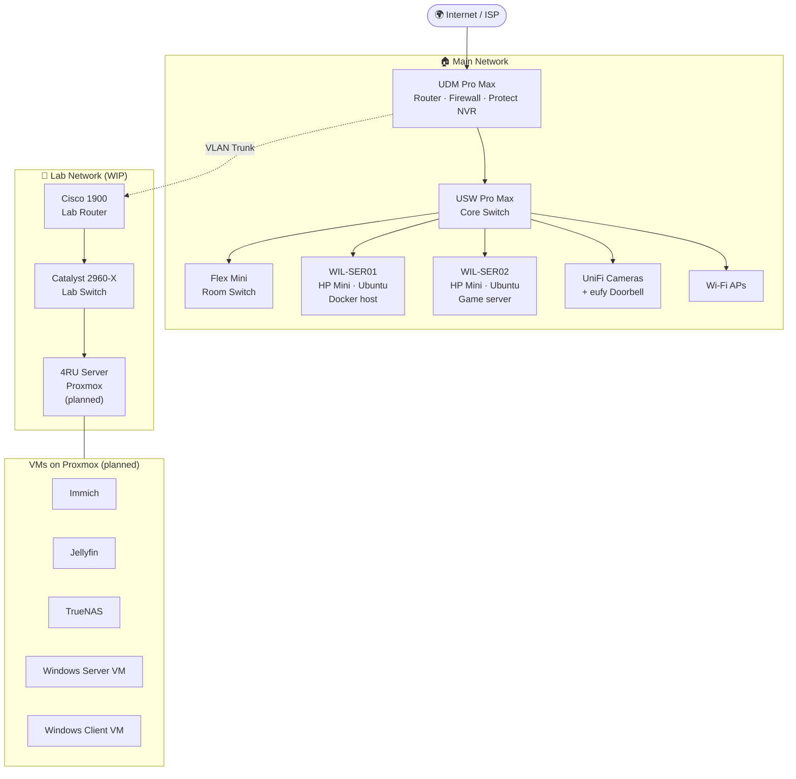

<div align="center">



# WiltonLab - the personal homelab where possibilities are endless

[](.)
[](docs/rack-layout.md)
[](inventory/hardware.md)
[](LICENSE)

[](docs/networking.md)
[](docs/networking.md)
[](docs/roadmap.md)
[](inventory/services.md)
[](inventory/hardware.md)
[](inventory/hardware.md)
[](inventory/services.md)

> A personal homelab built around UniFi networking, lightweight HP mini PCs for always-on services, and a growing Proxmox-based lab environment for experimenting with virtualization, storage, and self-hosted applications.

</div>

---

## 📑 Table of Contents

- [Overview](#-overview)
- [Status](#-status)
- [Rack Layout](#-rack-layout)
- [Hardware](#-hardware)
- [Network Topology](#-network-topology)
- [Services](#-services)
- [Roadmap](#-roadmap)
- [Repository Structure](#-repository-structure)
- [License](#-license)

---

## 🔭 Overview

This homelab serves three primary goals:

1. **Main Network** - Reliable home networking, Wi-Fi, and surveillance for daily use.
2. **Home Security** - Provides smart camera access for every member in the household
3. **Always-on services** — Self-hosted utilities like DNS-level ad blocking and HomeKit bridging for smart home gear that doesn't natively support it.
4. **Lab environment** — A separate playground network for learning enterprise networking (Cisco) and virtualization (Proxmox) without risking the main network.

Everything is housed in a single **22RU rack** backed by a **1500VA/900W Eaton UPS** for clean power and graceful shutdowns.

---

## 📊 Status

Live status of every component in the lab.

| Component | Type | Role | Status |
|-----------|------|------|:------:|
| **UDM Pro Max** | Network | Router · Firewall · NVR | 🟢 Online |
| **USW Pro Max** | Network | Core switch | 🟢 Online |
| **UniFi Flex Mini** | Network | Edge switch | 🟢 Online |
| **UniFi Protect** | Service | Surveillance | 🟢 Online |
| **WIL-SER01** | Compute | Docker host | 🟢 Online |
| **WIL-SER02** | Compute | Game server / cache | 🟢 Online |
| **Pi-hole** | Service | DNS / ad-block | 🟢 Online |
| **HomeBridge** | Service | HomeKit bridge | 🟢 Online |
| **Steam Cache** | Service | LAN game cache | 🟢 Online |
| **Eaton 5E UPS** | Power | 1500VA/900W battery backup | 🟢 Online |
| **Catalyst 2960-X** | Network (Lab) | Lab L2 switch | 🟡 In Progress - Needs Setup |
| **Cisco 1921** | Network (Lab) | Lab L3 router | 🟡 In Progress - Needs Setup |
| **WIL-HV01 (4RU)** | Compute | Proxmox hypervisor | 🔵 Planned |
| **Immich** | Service | Photo backup | 🔵 Planned |
| **Jellyfin** | Service | Media streaming | 🔵 Planned |
| **TrueNAS** | Service | Storage / NAS | 🔵 Planned |
| **Windows Server VM** | VM | AD lab | 🔵 Planned |
| **Windows Client VM** | VM | Domain client | 🔵 Planned |
| **WIL-MC-SVR** | Compute | Old MC Server |  Decommissioning - Transferred to WIL-SER02

**Legend:** 🟢 Online · 🟡 In Progress · 🔵 Planned · 🔴 Down · ⚫ Decommissioning/Decommissioned

---

## 🗄️ Rack Layout

| U | Equipment | Purpose |
|---|-----------|---------|
| 22 | _Reserved_ | Empty Space, Makeshift Shelf |
| 21 | _Reserved_ | Empty Space, Makeshift Shelf, holds eufy base |
| 20 | **UDM Pro Max** | Main router / firewall / UniFi Protect controller |
| 19 | _Patch Panels_ | Patching for everything in the house |
| 18 | **USW Pro Max**  | Main Switch |
| 17 | _Cable Management Brush_ | Clean management of loose cables to switch (for servers) |
| 16 | **WIL-SER01 + WILSER02** | Both machines in 3D-Printed Mount |
| 15–12 | Silverstone RM41-H04 (for WIL-HV01) | Case installed in rack, deciding on parts for case |
| 11 | Free Space | Future expansion |
| 10-9 | _2RU Drawer_ | Storage |
| 8-6 | Free Space | Future Expansion |
| 
| 3-1 | **Eaton 5E 900W UPS** | Power protection (may source rackmount one if more space required)|

> 📝 _Exact U positions are subject to change as things get moved around — see [`docs/rack-layout.md`](docs/rack-layout.md) for the actual diagram._

---

## 🖥️ Hardware

### Network

| Device | Model | Role | Status |
|--------|-------|------|:------:|
| Gateway | UniFi Dream Machine Pro Max | Router, firewall, NVR (UniFi Protect) | 🟢 |
| Core Switch | UniFi Switch Pro Max | Main L2/L3 switching | 🟢 |
| Access Switch | UniFi Flex Mini | Room-level connectivity | 🟢 |
| Lab Switch | Cisco Catalyst 2960-X | Lab Network / learning | 🟡 |
| Lab Router | Cisco 1900 Series ISR | Lab Network / learning | 🟡 |

### Compute

| Host | Hardware | OS | Role | Status |
|------|----------|----|----|:------:|
| `WIL-SER01` | HP Mini PC | Ubuntu Server | Docker host — utility containers | 🟢 |
| `WIL-SER02` | HP Mini PC | Ubuntu Server | Game server / Steam Cache | 🟢 |
| `WIL-HV01` _(planned)_ | 4RU rackmount server | Proxmox VE | Hypervisor — VMs and LXC | 🔵 |
| `WIL-MC-SVR`| Lenovo Thinkstation | Ubuntu Server | Old Game Server | ⚫

### Power

| Device | Model | Capacity |
|--------|-------|----------|
| UPS | Eaton 5E | 1500VA/900W |

📄 **Full specs:** [`inventory/hardware.md`](inventory/hardware.md)

---

## 🌐 Network Topology



### VLAN Plan

| VLAN | Name | Purpose |
|------|------|---------|
| 1 | Default / Management | Network gear management |
| 10 | Trusted | Personal devices, workstations |
| 20 | IoT | Smart home, cameras, doorbell |
| 30 | Guest | Isolated guest Wi-Fi |
| 40 | Servers | `WIL-SER01`, `WIL-SER02` |
| 99 | Lab | Cisco lab gear / Proxmox |

> Firewall rules enforce inter-VLAN restrictions; port-forwarding handled at the UDM. See [`docs/networking.md`](docs/networking.md) for full details.

---

## 📦 Services

### `WIL-SER01` — Utility host

| Service | Purpose | Status |
|---------|---------|:------:|
| **Pi-hole** | Network-wide DNS + ad blocking | 🟢 |
| **HomeBridge** | Bridges non-HomeKit devices into Apple Home (UniFi cameras, eufy Doorbell, Meross smart garage) | 🟢 |
| **Twingate Connector | Runs Twingate 

### `WIL-SER02` — Gaming / caching

| Service | Purpose | Status |
|---------|---------|:------:|
| **Steam Cache (lancache)** | LAN-side caching of game downloads | 🟢 |
| **Game servers** | Dedicated servers (Minecraft, etc.) | 🟢 |

### `WIL-HV01` _(planned)_ — Proxmox VMs

| VM / Service | Purpose | Status |
|--------------|---------|:------:|
| **Immich** | Self-hosted photo backup (Google Photos replacement) | 🔵 |
| **Jellyfin** | Media streaming | 🔵 |
| **TrueNAS** | Storage / NAS | 🔵 |
| **Windows Server VM** | AD / DNS / lab services | 🔵 |
| **Windows Client VM** | Domain-joined client for experimentation | 🔵 |

📄 **Full inventory:** [`inventory/services.md`](inventory/services.md)

---

## 🛣️ Roadmap

### Near-term

- [ ] Finish racking and cabling the Catalyst 2960-X
- [ ] Configure base VLAN trunk between UDM Pro Max and Cisco 1900
- [ ] IOS config / baseline for Cisco 1900 (working on CCNA)

### Mid-term

- [ ] Build out the 4RU server as a Proxmox hypervisor
- [ ] Migrate Immich onto Proxmox (replace cloud photo storage)
- [ ] Stand up Jellyfin VM/LXC
- [ ] Deploy TrueNAS VM with passed-through HBA + disks

### Long-term

- [ ] Windows Server + Windows client VMs for AD lab
- [ ] Backups: 3-2-1 strategy across TrueNAS + offsite
- [ ] Monitoring stack (Prometheus + Grafana, or Uptime Kuma)
- [ ] 10 GbE between hypervisor and TrueNAS storage

📄 **Detailed roadmap:** [`docs/roadmap.md`](docs/roadmap.md)

---

## 📁 Repository Structure

```
homelab/
├── README.md                  ← You are here
├── LICENSE                    ← CC BY 4.0
├── .github/
│   └── assets/
│       └── banner.svg         ← Hero banner
├── docs/
│   ├── networking.md          ← VLANs, firewall, port-forwards
│   ├── rack-layout.md         ← Detailed U-by-U rack diagram
│   └── roadmap.md             ← Detailed future plans
├── diagrams/
│   └── network-topology.md    ← Larger Mermaid diagrams
└── inventory/
    ├── hardware.md            ← Full hardware specs
    └── services.md            ← Every container / VM / service
```

---

## 📜 License

This documentation is licensed under [**Creative Commons Attribution 4.0 International (CC BY 4.0)**](LICENSE).

You are free to share and adapt this material for any purpose, including commercially, provided you give appropriate credit. Configs and scripts (if any) are provided as-is.

---

<div align="center">

_Last updated: 2026 · Built with patience, cable ties, and too much coffee ☕_

</div>
