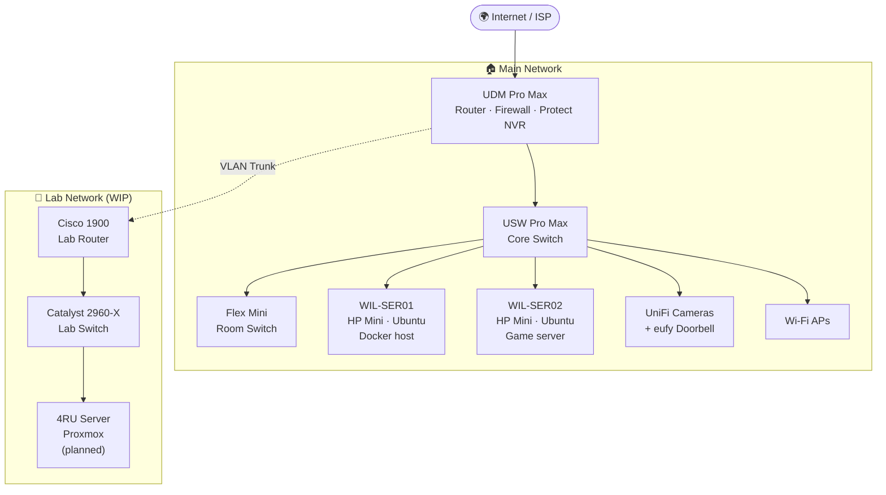
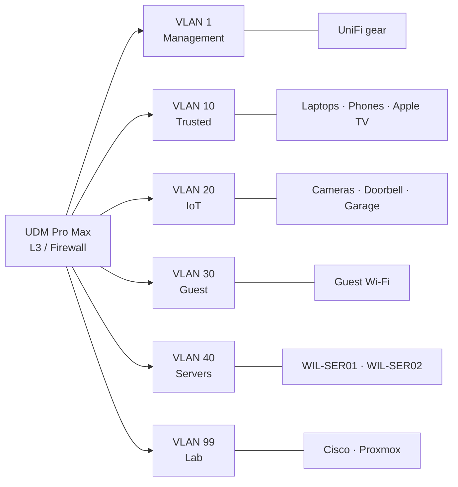
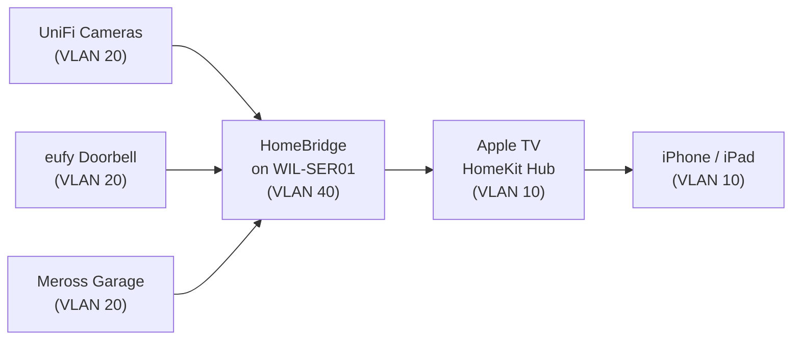
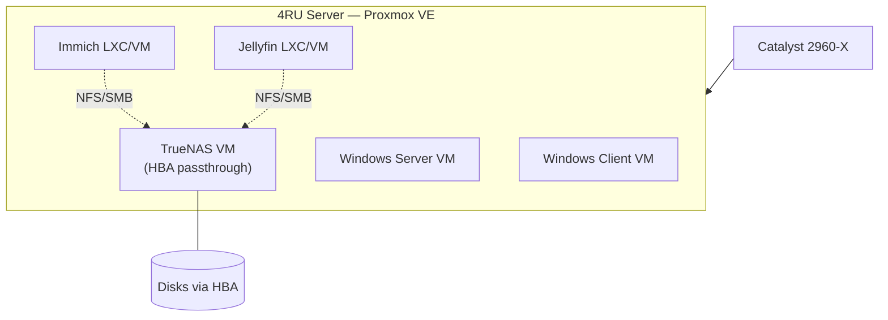

# 🗺️ Network Topology Diagrams

## High-level overview

```mermaid
flowchart TB
    Internet([🌍 Internet / ISP])

    subgraph Main["🏠 Main Network"]
        UDM["UDM Pro Max<br/>Router · Firewall · Protect NVR"]
        SwitchMain["USW Pro Max<br/>Core Switch"]
        FlexMini["Flex Mini<br/>Room Switch"]
        SER01["WIL-SER01<br/>HP Mini · Ubuntu<br/>Docker host"]
        SER02["WIL-SER02<br/>HP Mini · Ubuntu<br/>Game server"]
        Cams["UniFi Cameras<br/>+ eufy Doorbell"]
        APs["Wi-Fi APs"]
    end

    subgraph Lab["🧪 Lab Network (WIP)"]
        C1900["Cisco 1900<br/>Lab Router"]
        Cat2960["Catalyst 2960-X<br/>Lab Switch"]
        HV01["4RU Server<br/>Proxmox<br/>(planned)"]
    end

    Internet --> UDM
    UDM --> SwitchMain
    SwitchMain --> FlexMini
    SwitchMain --> SER01
    SwitchMain --> SER02
    SwitchMain --> Cams
    SwitchMain --> APs
    UDM -.VLAN Trunk.-> C1900
    C1900 --> Cat2960
    Cat2960 --> HV01
```

## VLAN segmentation

```mermaid
flowchart LR
    UDM["UDM Pro Max<br/>L3 / Firewall"]

    UDM --> V1["VLAN 1<br/>Management"]
    UDM --> V10["VLAN 10<br/>Trusted"]
    UDM --> V20["VLAN 20<br/>IoT"]
    UDM --> V30["VLAN 30<br/>Guest"]
    UDM --> V40["VLAN 40<br/>Servers"]
    UDM --> V99["VLAN 99<br/>Lab"]

    V1 --- UniFi["UniFi gear"]
    V10 --- Trusted["Laptops · Phones · Apple TV"]
    V20 --- IoT["Cameras · Doorbell · Garage"]
    V30 --- Guest["Guest Wi-Fi"]
    V40 --- Servers["WIL-SER01 · WIL-SER02"]
    V99 --- LabGear["Cisco · Proxmox"]
```

## HomeKit bridging flow

```mermaid
flowchart LR
    Cam["UniFi Cameras<br/>(VLAN 20)"]
    Door["eufy Doorbell<br/>(VLAN 20)"]
    Garage["Meross Garage<br/>(VLAN 20)"]

    HB["HomeBridge<br/>on WIL-SER01<br/>(VLAN 40)"]

    AppleTV["Apple TV<br/>HomeKit Hub<br/>(VLAN 10)"]
    iOS["iPhone / iPad<br/>(VLAN 10)"]

    Cam --> HB
    Door --> HB
    Garage --> HB
    HB --> AppleTV
    AppleTV --> iOS
```

## Future state — Proxmox build-out

```mermaid
flowchart TB
    Cat2960["Catalyst 2960-X"]

    subgraph HV01["4RU Server — Proxmox VE"]
        TN["TrueNAS VM<br/>(HBA passthrough)"]
        IM["Immich LXC/VM"]
        JF["Jellyfin LXC/VM"]
        WS["Windows Server VM"]
        WC["Windows Client VM"]
    end

    Storage[("Disks via HBA")]

    Cat2960 --> HV01
    TN --- Storage
    IM -.NFS/SMB.-> TN
    JF -.NFS/SMB.-> TN
```
